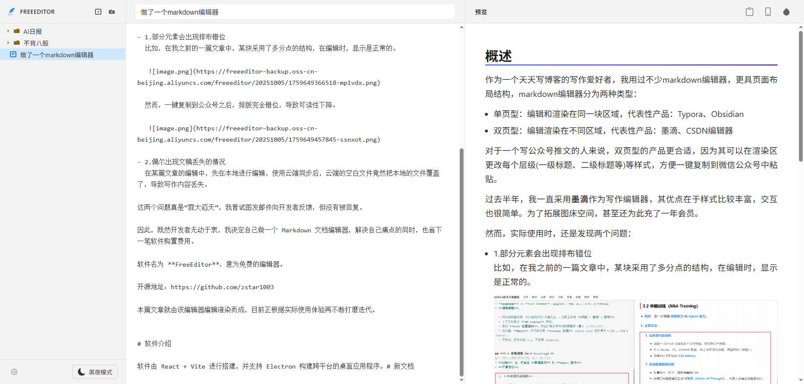

<div align="center">
  
</div>


# FreeEditor

一款简洁的 双栏 Markdown 编辑器，支持实时预览和微信公众号样式导出。



## ✨ 特性

- 📝 **实时预览** - 边写边看，所见即所得
- 🎨 **丰富样式库** - 内置多种精美的标题、代码、引用块样式
- 📱 **移动端预览** - 支持手机视图预览，适配微信公众号
- 📋 **一键复制** - 直接复制富文本，可粘贴到微信公众号编辑器
- 🌓 **主题切换** - 支持深色/浅色主题
- 📂 **文件夹管理** - 支持文件夹分类管理文档
- 🖼️ **图片上传** - 支持拖拽/粘贴上传图片到阿里云 OSS
- 💾 **本地存储** - 自动保存，数据存储在本地
- 🔧 **备份恢复** - 支持数据导出和导入
- 🖥️ **Electron支持** - 可打包成桌面应用

## 🚀 快速开始

### 安装依赖

```bash
npm install
```

### 开发模式

```bash
# Web 开发
npm run dev

# Electron 开发
npm run electron:dev
```

### 构建

```bash
# Web 构建
npm run build

# Electron 构建
npm run electron:build
```

## 📖 功能说明

### 样式自定义

支持自定义以下元素的样式：

- **标题** - H1/H2/H3 多种样式可选
- **代码** - 行内代码和代码块样式
- **引用块** - 多种引用样式
- **字体** - 字体系列和字号设置

### 图片上传

配置阿里云 OSS 后，可以：

1. 直接粘贴图片到编辑器
2. 拖拽图片到编辑器
3. 自动上传并插入 Markdown 图片语法

在设置中配置 OSS 信息：

- Region（地域）
- AccessKey ID
- AccessKey Secret
- Bucket（存储空间）

### 文件管理

- 创建文件夹分类管理文档
- 拖拽文件到文件夹
- 右键重命名/删除文件和文件夹
- 自动保存到本地存储

### 导出到微信公众号

1. 在预览区选择合适的样式
2. 点击复制按钮
3. 粘贴到微信公众号编辑器

## 🛠️ 技术栈

- **React 19** - UI 框架
- **TypeScript** - 类型安全
- **Vite** - 构建工具
- **Marked** - Markdown 解析
- **Electron** - 桌面应用
- **阿里云 OSS** - 图片存储

## 📝 开发说明

### 项目结构

```
md_editor/
├── src/
│   ├── components/     # 组件
│   │   ├── Editor.tsx      # 编辑器
│   │   ├── Preview.tsx     # 预览区
│   │   ├── Sidebar.tsx     # 侧边栏
│   │   ├── Settings.tsx    # 设置
│   │   └── Modal.tsx       # 模态框
│   ├── styles/        # 样式
│   │   └── themes.ts       # 样式库
│   ├── utils/         # 工具
│   │   └── ossUpload.ts    # OSS上传
│   ├── types/         # 类型定义
│   ├── App.tsx        # 主应用
│   └── main.tsx       # 入口
├── electron/          # Electron 配置
├── public/            # 静态资源
└── package.json
```

## 📄 许可证

MIT

## 🤝 贡献

欢迎提交 Issue 和 Pull Request！

## 📧 联系

如有问题或建议，欢迎反馈。
